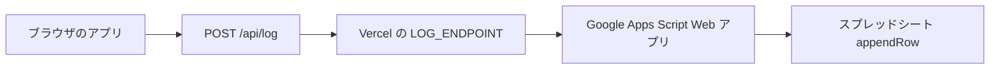

# スプレッドシートにログが入るまでの手順（全体）

対象スプレッドシート（gid=`1471844174` のシート）:

`https://docs.google.com/spreadsheets/d/1Cr2w3GpVxiqoK9ILBVQ_-6_TdjRnjfQBTHNYWCW4bpk/edit?gid=1471844174`

データの流れは次のとおりです。



アプリが送る JSON の形は **`lib/logger.ts`** で固定です。列の並びと一致させるのは **Google Apps Script（GAS）** 側です（[`google-apps-script.md`](./google-apps-script.md) のサンプル）。

---

## 事前チェック（スプレッドシートを開いて確認）

1. **編集権限**がある Google アカウントで開けるか。  
2. ログを書き込みたい **タブ**が URL の **gid=1471844174** と同じか（左下のシート切り替えで確認）。  
3. **列の並び**（推奨）:
   - **A〜U の 21 列**が、[`google-apps-script.md`](./google-apps-script.md) の「列定義」「`HEADERS_EN`」と**同じ順**になっているか。  
   - すでに手作業で列名を変えている場合は、**GAS の `appendRow([...])` の並び**をシートに合わせて書き換える必要があります（下記「既存シート列と違うとき」）。

空のシート、または **1 行目が空**なら、ドキュメントの GAS をそのまま使うと、初回 POST 時に **1〜2 行目にヘッダ**が自動で入ります（`ensureHeaders`）。

---

## 手順 1: Google Apps Script を用意する

**推奨**: スプレッドシートを開いた状態で **拡張機能 → Apps Script** を開く（このブックに紐づくプロジェクトになり、権限が取りやすいです）。

1. 上記スプレッドシートを開く。  
2. **拡張機能 → Apps Script**  
3. デフォルトの `Code.gs` を開き、[google-apps-script.md](./google-apps-script.md) の **Google Apps Script（コピペ用）** ブロックを **すべて貼り替え**  
4. **保存**（ディスクアイコン）  
5. 実行権限: 初めて保存したあと、メニューから関数は不要。次の「デプロイ」でまとめて承認されます。

---

## 手順 2: ウェブアプリとしてデプロイする

1. 右上 **デプロイ → 新しいデプロイ**  
2. 種類の歯車で **ウェブアプリ** を選択  
3. 設定例:
   - **説明**: 任意（例: `log v1`）  
   - **次のユーザーとして実行**: **自分**  
   - **アクセスできるユーザー**: **全員**（※ この URL を知っている人が POST できます。URL は秘密にしてください）  
4. **デプロイ** をクリック  
5. **アクセスを承認**（Google の許可画面が出たら進める）  
6. 表示される **ウェブアプリの URL** をコピー（`https://script.google.com/macros/s/xxxx/exec` のような形式）

この URL が **GAS のエンドポイント**です。

---

## 手順 3: Vercel に `LOG_ENDPOINT` を設定する

1. [Vercel](https://vercel.com) → 対象プロジェクト → **Settings → Environment Variables**  
2. **Name**: `LOG_ENDPOINT`  
3. **Value**: 手順 2 でコピーした **ウェブアプリ URL**（末尾が `/exec` のもの）  
4. **Production**（必要なら Preview / Development も）にチェック  
5. **Save**  
6. **Deployments** から **Redeploy**（環境変数を読み込ませるため）

ローカルだけ試す場合は `ab-prototype/.env.local` に同じく:

```bash
LOG_ENDPOINT=https://script.google.com/macros/s/……/exec
```

---

## 手順 4: アプリで動作確認する

1. デプロイ済みの本番 URL（または `npm run dev`）を開く  
2. 言語選択 → 基本情報 → … → **少なくとも 1 パターン**商品詳細を進める（またはタイムアウトで終了）  
3. スプレッドシートを再読み込みし、**新しい行**が追加されているか確認  

失敗時はクライアントが **localStorage** に残しているので、アプリ内「ログ確認」画面でも内容を確認できます（[`lib/logger.ts`](../lib/logger.ts)）。

---

## 手順 5: うまく入らないとき

| 症状 | 確認すること |
|------|----------------|
| シートに一切行が増えない | Vercel の `LOG_ENDPOINT` が正しいか、再デプロイしたか。ブラウザ開発者ツール **Network** で `/api/log` が **200** か（**502/503** なら GAS URL 未設定または GAS エラー） |
| `/api/log` が 503 | サーバーに `LOG_ENDPOINT` が無い。Vercel の環境変数を確認 |
| GAS でエラー | Apps Script の **実行数・実行 log**（表示 → ログ）で `doPost` の例外を確認。`getSheetById` でシートが見つからない場合は **gid** を再確認 |
| 列がずれて入る | シートの **A 列からの列順** と `appendRow` の配列の順が一致しているか。手動で列を挿入・並べ替えしているとずれます |

### 既存シートの列の並びがドキュメントと違うとき

1. スプレッドシートの **1 行目**を、[`google-apps-script.md`](./google-apps-script.md) の `HEADERS_EN` の順にそろえるか、  
2. または **GAS 内の `appendRow([...])` の要素順**を、あなたの 1 行目の列順に合わせて並べ替える。  

Next.js 側の JSON フィールド名（`sessionId`, `durationSec` など）は変わりません。**GAS で「どの列に何を書くか」だけ**合わせればよいです。

---

## プログラム（Next.js）側でいじる場所

| 役割 | ファイル |
|------|----------|
| 送信ボディ（pattern / event） | [`lib/logger.ts`](../lib/logger.ts) の `logPatternResult` / `logEvent` |
| 型・フィールド一覧 | [`types/experiment.ts`](../types/experiment.ts) の `PatternLog` / `EventLog` |
| Vercel へのプロキシ | [`app/api/log/route.ts`](../app/api/log/route.ts) |

スプレッドシートの列を増やしたい場合は、**まず `PatternLog` / `EventLog` に項目を追加** → **`logPatternResult` で送るオブジェクトに含める** → **GAS の `appendRow` に列を足す**の順が安全です。
