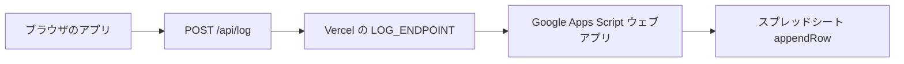

# スプレッドシート設定（ログが入るまでの手順）

## 全体の流れ



1. **Google スプレッドシート**を用意し、タブ **`jp`** と **`ko`** を作る（旧ドキュメントどおり **`kr`** だけの場合は GAS が `ko` を探してから `kr` にフォールバックします）。  
2. 同じブックの **Apps Script** に `doPost` を書き、**ウェブアプリとしてデプロイ**して URL を取得する。  
3. **Vercel**（またはローカル）の環境変数 **`LOG_ENDPOINT`** にその URL を入れる。  
4. 参加者が実験を**最後まで完了**すると、JSON が GAS に届き、**`jp` または `ko` シート**に 1 行追加されます（`ko` が無いときは **`kr`** タブを使う GAS 例あり）。

送信する JSON の形は **`types/experiment.ts` の `ParticipantSessionLog`**、GAS の `appendRow` の**値の列順**は **`lib/csv.ts` の `participantSessionsToCsv`** と揃えると、CSV ダウンロードと一致しやすいです。**2 行目の表示名**は **`jp` シート＝日本語、`ko` シート＝韓国語**（`lib/participantSessionHeaders.ts` の `getParticipantSessionCsvHeaders`）。

**シートの行の意味:** **1 行目＝英語キー**、**2 行目＝日本語（`jp`）または韓国語（`ko`）の見出し**、**3 行目以降＝参加者データ**（**A 列は通し番号**）。GAS の例（`ensureParticipantSessionHeaderRows`）は、シートが空のときだけ 1〜2 行目にヘッダを書きます。  
**記録先タブ**は **`language` が `"ko"` なら `ko`（旧 `kr` 可）、`"ja"` なら `jp`**（アプリの `/api/log` と `lib/logger.ts` でも同じ）。  
**条件ごとの列ブロックの並び**は、表示パターンの訪問順ではなく **常に「何もなし（none）→ 販売量（sales_volume）→ デザインの好み（design_preference）→ 体型（body_type）」** です（`lib/experiment.ts` の `CANONICAL_CONDITION_ORDER`）。

**GAS のコピペ例（`doPost`・`sheetTab`・`appendRow`）**は **[google-apps-script-participant-session.md](./google-apps-script-participant-session.md)** を参照してください。

---

## 事前準備（スプレッドシート）

1. ログ用の **ブック**を作成（または既存を使用）。  
2. 下部のタブでシートを **2 つ**用意し、名前を次のようにする（**名前が一致している必要があります**）。

| タブ名 | 用途 |
|--------|------|
| **`jp`** | 日本語 UI を選んだ参加者のログ |
| **`ko`** | 韓国語 UI を選んだ参加者のログ（**`kr`** タブのみのブックは GAS のフォールバックで可） |

3. ブックの URL から **スプレッドシート ID** を控える（`/d/` と `/edit` の間の文字列）。GAS の `SPREADSHEET_ID` に使います。

---

## 手順 1: Google Apps Script を作成する

1. 上記スプレッドシートを開く。  
2. **拡張機能 → Apps Script**。  
3. スクリプトに **[google-apps-script-participant-session.md](./google-apps-script-participant-session.md)** の「`doPost` で `sheetTab` によりシートを切り替える」例を貼り付け、`SPREADSHEET_ID` を自分の ID に書き換える。  
4. **保存**（ディスクアイコン）。

---

## 手順 2: ウェブアプリとしてデプロイする

1. 右上 **デプロイ → 新しいデプロイ**。  
2. 種類の歯車で **ウェブアプリ** を選択。  
3. 推奨設定:
   - **次のユーザーとして実行**: **自分**  
   - **アクセスできるユーザー**: **全員**（※ URL は第三者に知られないように保管）  
4. **デプロイ** → **アクセスを承認**（初回のみ Google の許可画面）。  
5. 表示される **ウェブアプリの URL** をコピー（`https://script.google.com/macros/s/…/exec` 形式）。

---

## 手順 3: `LOG_ENDPOINT` を設定する

### Vercel（本番）

1. [Vercel](https://vercel.com) → 対象プロジェクト → **Settings → Environment Variables**  
2. **Name**: `LOG_ENDPOINT`  
3. **Value**: 手順 2 の **ウェブアプリ URL**  
4. **Save** のあと、**Deployments** から **Redeploy**（環境変数を読み込ませるため）

### ローカル（`npm run dev`）

プロジェクト直下に `.env.local` を作成（または追記）:

```bash
LOG_ENDPOINT=https://script.google.com/macros/s/……/exec
```

`LOG_ENDPOINT` が無いと `/api/log` は **503** になり、送信は失敗します（[`app/api/log/route.ts`](../app/api/log/route.ts)）。

---

## 手順 4: 動作確認

1. デプロイ済みの本番 URL、または `npm run dev` でアプリを開く。  
2. 実験を **3 条件すべて完了**し、**完了画面**まで進める（このとき **`participantSession`** が 1 回送信される）。  
3. スプレッドシートの **`jp`** または **`ko`**（または **`kr`**）を開き、**新しい行**が追加されているか確認する。

失敗時はブラウザの **開発者ツール → Network** で `/api/log` が **200** か確認する。**502/503** のときは `LOG_ENDPOINT` 未設定や GAS エラーの可能性があります。  
アプリ内の「ログ確認」や、[`lib/logger.ts`](../lib/logger.ts) の localStorage 退避も参照できます。

---

## うまくいかないとき

| 症状 | 確認すること |
|------|----------------|
| 行が増えない | Vercel の `LOG_ENDPOINT`、再デプロイ、`/api/log` が 200 か |
| `/api/log` が 503 | サーバーに `LOG_ENDPOINT` が無い |
| GAS でエラー | Apps Script の **実行ログ**（表示 → ログ）。**`jp` / `ko`（または `kr`）** のシートがあるか |
| 列がずれる | データ行の **列の並び** と GAS の `buildParticipantRow` / [`participantSessionsToCsv`](../lib/csv.ts) の **値の順**を一致させる（ヘッダ行は言語付きで表示のみ） |

---

## コード上の参照（Next.js）

| 内容 | ファイル |
|------|----------|
| 送信処理 | [`lib/logger.ts`](../lib/logger.ts) の `logParticipantSession` |
| 1 行分のデータ型 | [`types/experiment.ts`](../types/experiment.ts) の `ParticipantSessionLog` |
| CSV と同じ列イメージ | [`lib/participantSessionHeaders.ts`](../lib/participantSessionHeaders.ts) の `getParticipantSessionCsvHeaders`（見出し）／[`lib/csv.ts`](../lib/csv.ts) の `participantSessionsToCsv`（データ） |
| API プロキシ | [`app/api/log/route.ts`](../app/api/log/route.ts) |

補助の `logEvent` や旧 `pattern` 形式は [`google-apps-script.md`](./google-apps-script.md) の記述が古い場合があります。**本番の主ログは `participantSession`** です。
